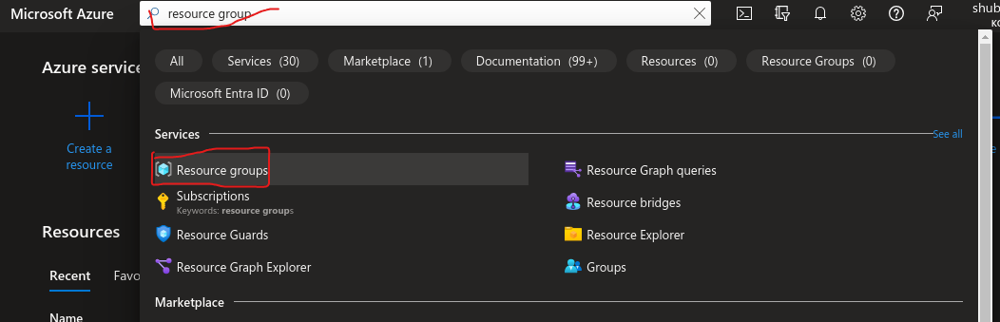
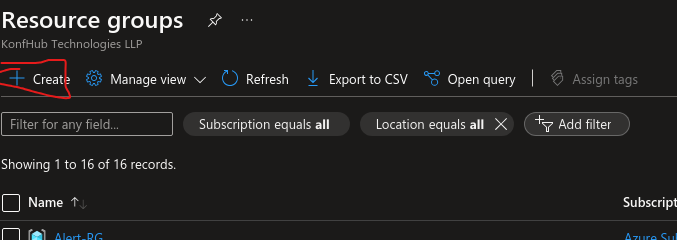
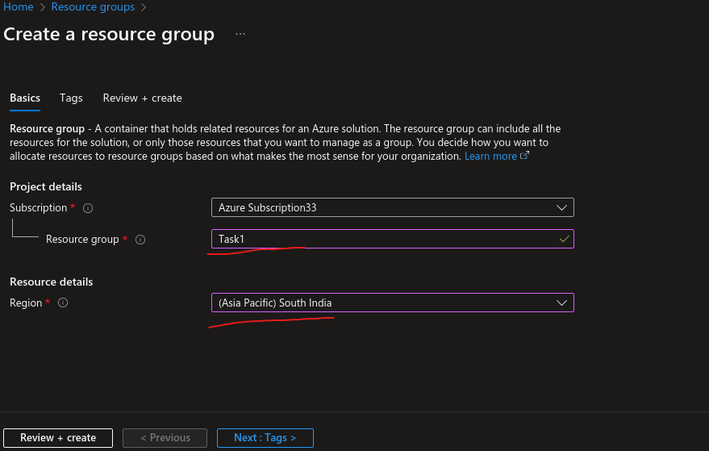
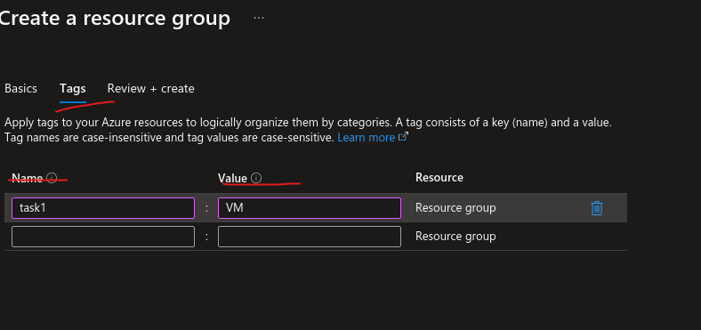
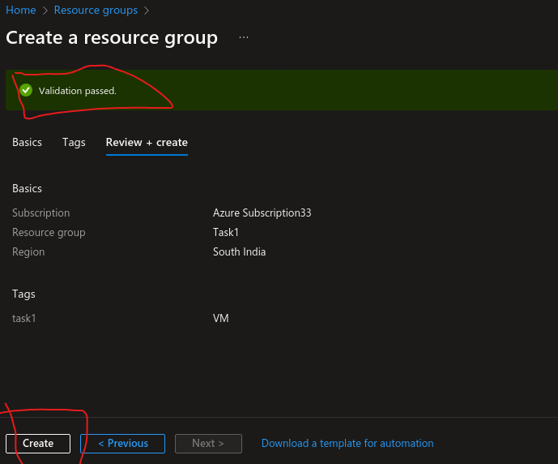
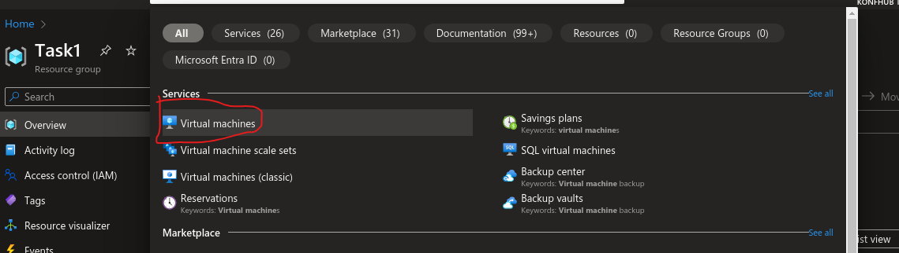
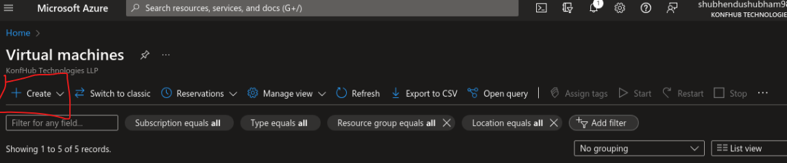
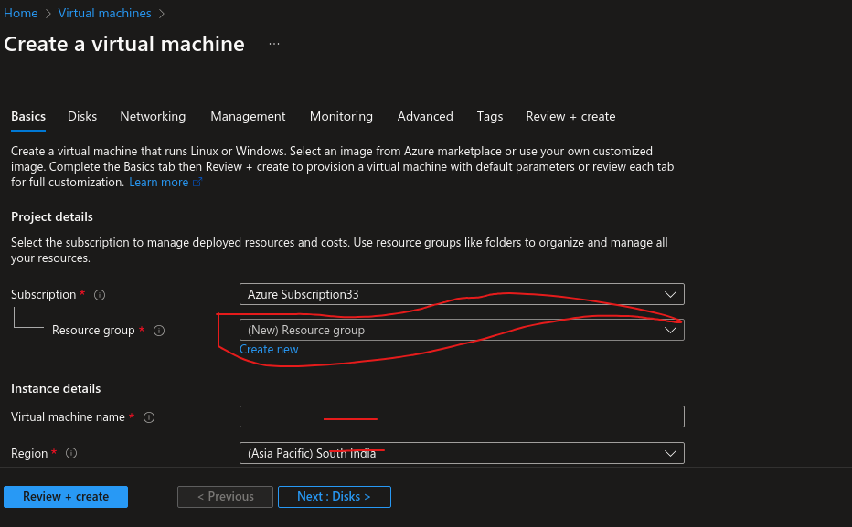
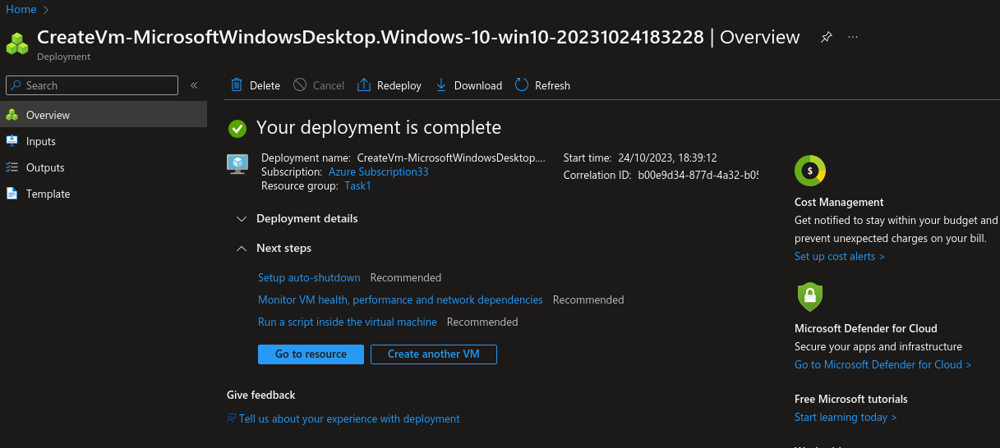

# fitaAcademy
this is fita academy tutorials 

## Day 1 Practicals :-

Task 1 : 

1. Create a Resource Group 
2. Set Nearest location 
3. Create a Virtual Machine (VM)
4. Disk Size 1 TB 
5. RAM / Memory 8 GiB 
6. Image (OS) windows 
7. Setup username & Pswrd 
8. Deploy RDP (Windows)1024
9. Access
10. Clean Resource 

Solution: 

1. Search for RG and Create

2. Fill Details and click on Next 

3. Tag for classification and category .It helps in sorting

4. Click on Review and Create and Validation should be passed 

5. After Successful RG creation 

Now let's create a VM 

steps for creating VM 

1. Search VM in search Box 

2. Click on create 

3. Select Same RG(Resource Group)
then name your VM 

4. After creation VM, this message will popup 

